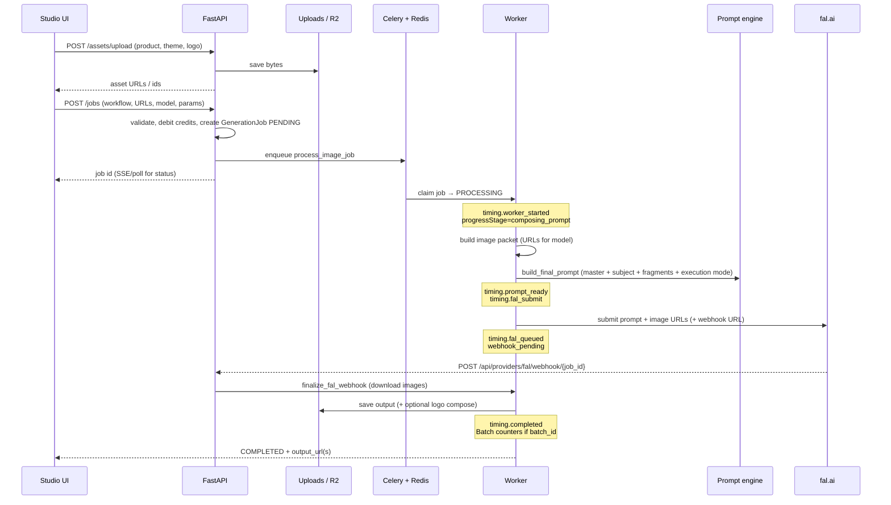

# Jewel AI — Generation Process & Performance Monitoring

How a Studio job becomes a fal.ai image — **single** and **bulk** — and what timing the app actually records today.

---

## 1. Does the app monitor performance?

**Yes.** Jewel AI records stage timestamps, fal’s native `metrics.inference_time`, and derived duration splits. Admin → Monitoring still shows a single Duration column in the UI (unchanged), but the metrics API also returns phase fields. Studio ETA uses de-poisoned samples (prefer GPU time).

| Question | Tracked today? |
| --- | --- |
| Time to upload images to Jewel storage | Yes — `upload_ms` on `/assets/upload` response + structured logs (not on the job) |
| Time to compose prompt + prep images (our worker) | Yes — `prep_ms` / `timing.prompt_ready − worker_started` |
| Time to **submit** prompt + images to fal | Yes — `fal_submit` / `fal_queued` |
| Time **fal spends generating** | Yes — `fal_inference_time` from fal `metrics.inference_time` when present |
| Finalize (CDN download + logo + R2) | Yes — `finalize_ms` / `fal_webhook_received → storage_saved` |
| Per-job / per-batch dashboard of those splits | API yes (`durationSplits`, admin `prep_ms`…); UI charts deferred |
| Batch wall-clock | Yes — `batches.started_at` / `completed_at` |

### What is recorded

Each job stores ISO timestamps under `provider_metadata.timing`:

| Key | When set | Meaning |
| --- | --- | --- |
| `queued` | Job create / retry | Accepted into queue |
| `worker_started` | Celery claim `PENDING → PROCESSING` | Our worker picked up the job |
| `prompt_ready` | After `build_final_prompt` | Prompt + layers assembled |
| `fal_submit` | Right before fal route call | About to call fal |
| `fal_queued` | After fal accepts webhook job | fal has a `request_id`; waiting on callback |
| `fal_webhook_received` | Webhook handler / poll recovery | fal callback (or poll) reached us |
| `storage_saved` | After output written to storage | CDN download + logo + R2 done |
| `completed` | Same window as storage_saved | Job finished on our side |
| `failed` / `cancelled` | Terminal error / cancel | Stopped |

Also:

- `fal_inference_time` (seconds) from fal payload `metrics.inference_time`
- `provider_metadata.durationSplits` — `prep_ms`, `fal_inference_ms`, `fal_queue_wait_ms`, `finalize_ms`, `worker_total_ms`
- `processing_started_at` on `generation_jobs`
- `progressStage`: `composing_prompt` → `waiting_on_fal` → `completed` / `failed`
- Rolling ETA samples in Redis (`jewel:eta:{model}`) prefer **GPU / non-finalize** duration
- Admin metrics API: `duration_ms` plus `prep_ms`, `fal_inference_ms`, `finalize_ms`, `worker_total_ms`
- Bulk enqueue: no Celery countdown stagger; `FAL_CELERY_RATE_LIMIT` (default `10/s`)

### How to compute phases from timestamps

```text
Prep:
  prompt_ready − worker_started

Pure GPU (preferred):
  fal_inference_time   (from fal metrics)

Fal queue wait (approx):
  (fal_webhook_received − fal_queued) − fal_inference_time

Finalize & save:
  storage_saved − fal_webhook_received

End-to-end worker time:
  completed − worker_started
```

### Where you can see it

| Surface | What you see |
| --- | --- |
| Studio job stage bar | Coarse stages + ETA (improved sample source) |
| Job JSON (`provider_metadata.timing` / `durationSplits`) | Full timestamp map + splits |
| Admin → Monitoring UI | Counts, cost, success rate, single Duration (UI unchanged) |
| Admin metrics API `recent_jobs` | Also `prep_ms`, `fal_inference_ms`, `finalize_ms`, `worker_total_ms` |
| Logs | `asset_upload_complete` / `asset_bulk_upload_complete` with `upload_ms` |
| Batch API | `started_at`, `completed_at` |

See [Issues.md](./Issues.md) for gap status.

---

## 2. End-to-end process (single generation)



### Step detail

1. **Upload** — Browser posts files to `/api/assets/upload` (or bulk-upload). Stored as `Asset` rows; Studio may also persist theme/logo in brand kit / session.
2. **Create job** — `POST /api/jobs` with workflow, jewelry types, prompt overrides, model endpoint, aspect ratio, input/reference/logo URLs.
3. **Queue** — Prefer Celery worker; else inline thread (dev / if allowed). Job stays `PENDING` until claimed.
4. **Worker claim** — Atomic `PENDING → PROCESSING`, set `processing_started_at` + `timing.worker_started`.
5. **Image prep** — Map product / reference / portrait / logo into the fields the selected fal model expects (`build_model_image_plan`).
6. **Prompt compose** — DB masters + subjects + Admin fragments + catalog/try-on execution mode + attachment map → final text + negative (`build_final_prompt`). Stamp `prompt_ready` / `fal_submit`.
7. **fal call** — `route_generation` submits to fal (usually async webhook). Stamp `fal_queued` + `fal_request_id`.
8. **Wait** — Job stays `PROCESSING` with `progressStage=waiting_on_fal` until webhook (or poll recovery).
9. **Finalize** — Download fal CDN images, optional logo compose, save to storage, `COMPLETED`, `timing.completed`, record duration sample for ETA.
10. **UI** — Studio SSE/poll updates stage bar, shows output, History lists the job.

---

## 3. Bulk generation (special focus)

Bulk is **N jobs under one `Batch`**, not one fal call with N images.

### Trigger (Studio)

1. User uploads **multiple** product images (`POST /assets/bulk-upload`).
2. Optional shared **theme** (`reference_url`) and **logo**.
3. Generate → `POST /api/jobs/bulk` with `asset_ids[]` + shared settings.

### API behavior (`POST /api/jobs/bulk`)

```text
Validate workflow + shared URLs
  → Resolve catalogMode / tryOnMode
  → Load all assets (must belong to user)
  → Debit credits × N assets
  → Create Batch (status PROCESSING, total_jobs = N)
  → Create Project
  → For each asset:
        GenerationJob(PENDING, batch_id, input_url=that asset,
                      shared reference/model/logo in metadata)
  → enqueue_image_jobs(job_ids, stagger_ms=250)
  → Return { batchId, jobIds, total, queueMode }
```

### Queue stagger

Jobs are enqueued with **250 ms countdown between each** (Celery `countdown`) to avoid a fal stampede. Example: job 0 immediate, job 1 after 0.25s, job 2 after 0.5s, …

Workers still run **in parallel** up to Celery concurrency — stagger only spaces *start* times.

### Per-item pipeline

Each bulk job runs the **same** single-job pipeline (compose → fal → webhook → save). Shared pieces:

- Same workflow / jewelry / model / catalog mode
- Same theme / portrait / logo URLs
- Different `input_url` (product) and `asset_id`

Environment rotation (modern catalog) can vary backgrounds across jobs using Redis rotation keyed by user/job context.

### Batch status rollup (`_update_batch`)

After each job completes / fails / cancels:

| Condition | Batch status |
| --- | --- |
| All `COMPLETED` | `COMPLETED` |
| Mix of completed + failed | `COMPLETED_WITH_ERRORS` |
| All cancelled (none completed/failed) | `CANCELLED` |
| Still running | stays `PROCESSING` |

Fields: `total_jobs`, `completed_jobs`, `started_at`, `completed_at`, `updated_at`. Studio polls `GET /api/jobs/batches/{batchId}` and merges child jobs into the session tray.

Jobs are enqueued **immediately** (`stagger_ms=0`). Celery `FAL_CELERY_RATE_LIMIT` (default `10/s`) protects local DB/R2 without delaying batch start.

### Bulk timing / monitoring

| Need | Today |
| --- | --- |
| Per-item duration | `timing` + `durationSplits` / admin phase fields |
| Batch wall-clock | `batches.started_at` → `completed_at` |
| Average / p95 fal time for a batch | Not aggregated in Admin UI (per-job `fal_inference_ms` available) |
| Progress UI | Batch panel + per-job stages in Studio |

---

## 4. Timing diagram (one job)

```text
created_at
   │  [queue wait]
   ▼
worker_started ──────── composing_prompt / image prep
   │
prompt_ready
fal_submit ──────────── HTTP submit to fal
   │
fal_queued ──────────── fal accepted (webhook path)
   │  [fal queue + GPU — see fal_inference_time]
   ▼
fal_webhook_received ── webhook / poll hit API
   │  [CDN download + logo + R2]
   ▼
storage_saved / completed
```

**Upload time** (theme/logo/product) happens **before** job create; tracked as `upload_ms` on the asset upload response / logs.

---

## 5. Code map

| Concern | Location |
| --- | --- |
| Single job create | `backend/app/api/routers/jobs.py` |
| Bulk create + batch | `jobs.py` → `POST /bulk`, `_update_batch` in `tasks/generate.py` |
| Enqueue (no stagger) | `backend/app/services/queue_dispatch.py` |
| Worker + timing stamps | `backend/app/tasks/generate.py` |
| ETA / splits / fal metrics | `backend/app/services/job_timing.py` |
| fal webhook receipt stamp | `backend/app/api/routers/providers.py` |
| Asset upload_ms | `backend/app/api/routers/assets.py` |
| Admin duration + phases | `misc.py` `/admin/metrics` |
| Studio stages | `JobStageBar.tsx`, `useJobStream` |

---

## 6. Remaining (UI-only)

Backend phase splits and batch wall-clock are live. Optional follow-up (not done): Admin/Studio columns for Prep / Fal GPU / Finalize and batch wall time. Until then, use API `durationSplits` / metrics JSON.

---

## 7. Related docs

- [Issues.md](./Issues.md) — gap status  
- [LATENCY_INVESTIGATION_REPORT.md](./LATENCY_INVESTIGATION_REPORT.md) — 2026-07-22 production FAL vs app bottleneck  
- [PROMPT_PIPELINE.md](./PROMPT_PIPELINE.md) — how prompts are built  
- [BACKEND.md](./BACKEND.md) — services, routers, workers  
- [jewel_ai_prompt_engine_architecture.md](./jewel_ai_prompt_engine_architecture.md) — catalog execution modes  
