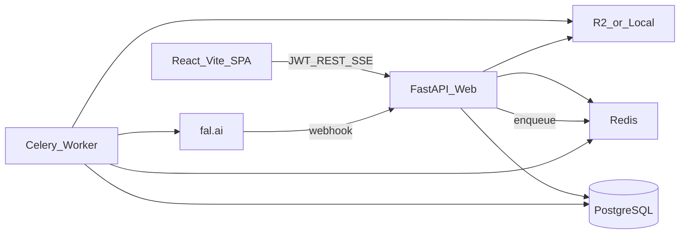
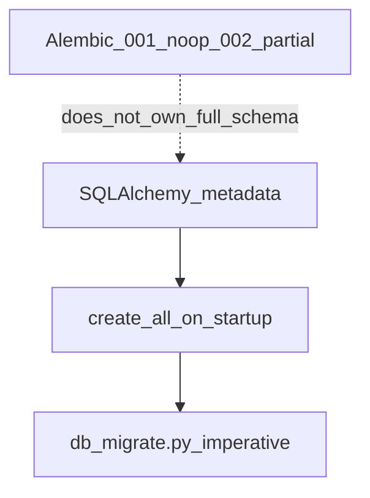
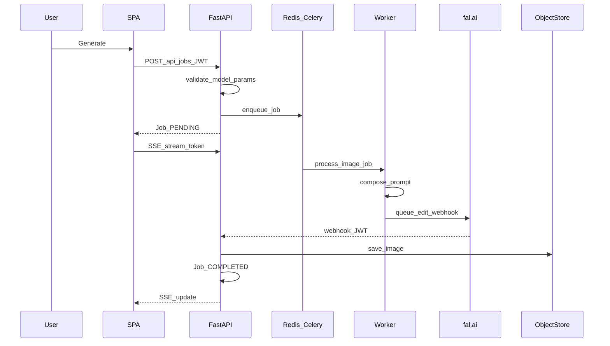

# Jewel AI V3 — System Audit Report

**Date:** 11 July 2026  
**Scope:** Full-stack production readiness (frontend, backend, database, security, DevOps, AI, UX, testing)  
**Method:** Evidence-based code review of the current workspace; cross-checked against [AUDIT_REPORT.md](./AUDIT_REPORT.md) and live Railway project state (`merry-curiosity`).  
**Constraint:** Findings below are verified in source. Speculative issues are excluded.

---

## Executive Summary

Jewel AI V3 is a FastAPI + React/Vite jewelry image studio with JWT auth, a DB-backed prompt matrix, Celery workers, and fal.ai as the sole image provider. Core product flows (login → Studio generate → queue → fal → storage → SSE/History) are implemented and operable in production at `https://jewel-ai.up.railway.app`.

**Verdict:** Suitable for controlled production use with known operators, **not yet enterprise-hardened**. Several Critical/High issues remain: authenticated SSRF on job image URLs, startup seed password resets, schema migration drift, stuck webhook jobs, unauthenticated media serving, and frontend auth/session bugs. Local workspace also diverges from Railway (credit gate still live in prod; Usage Monitor and credit removal exist only locally until deploy).

| Severity | Open count (this audit) |
|----------|-------------------------|
| Critical | 4 |
| High | 7 |
| Medium | 14 |
| Low | 8 |

**Strengths already in place:** Job/asset API tenancy, fal webhook JWT + allowlisted webhook fetch, magic-byte upload validation, circuit breaker, Redis rate limiting (partial), `/admin/usage` monitoring (local), credit limits removed in local tree (fal owns billing).

---

## Architecture Review

### Current topology

### Layering

| Layer | Path | Maturity |
|-------|------|----------|
| Presentation | `backend/app/api/routers/`, `frontend/src/pages/` | Primary |
| Application | `backend/app/application/` | Thin facades |
| Domain | `backend/app/domain/` | Thin enums |
| Infrastructure | `providers/`, `storage/`, `tasks/` | Primary |
| Pipeline | `backend/app/pipeline/` | Primary |

Clean Architecture folders exist but most business logic lives in routers, pipeline, and providers. SOLID is partially applied (provider adapter + router); Studio/Admin UI are large monoliths.

### Schema ownership problem

---

## Finding template key

Each finding: **ID · Module · Description · Root cause · Impact · Severity · Solution · Guidance · Verification**

---

## Frontend Audit

### F-H1 — Auth refresh clears tokens but not React auth state

| Field | Detail |
|-------|--------|
| **Module** | `frontend/src/lib/api.ts`, `frontend/src/hooks/useAuth.ts` |
| **Description** | On refresh failure, `clearTokens()` runs but `hasToken` stays `true`, so `/auth/me` keeps firing 401s while guards treat the user as logged out. |
| **Root cause** | Token clear is not synchronized with `useAuth` state / React Query. |
| **Impact** | Broken session UX; request spam; confusing “logged in but can’t act” state. |
| **Severity** | High |
| **Solution** | On refresh failure: clear tokens, set `hasToken` false, clear user query, redirect to `/login`. |
| **Guidance** | Emit a small `auth:logout` event from the Axios interceptor; subscribe in `useAuth`. |
| **Verification** | Expire refresh token → confirm single redirect to login and no further `/auth/me` calls. |

### F-H2 — `mediaUrl` is a no-op; no image 404 fallback

| Field | Detail |
|-------|--------|
| **Module** | `frontend/src/lib/api.ts` (`mediaUrl`), Studio/History/Modal `` usage |
| **Description** | `mediaUrl` returns the path unchanged. No `onError` on images. |
| **Root cause** | Assumes same-origin `/uploads` proxy always works. |
| **Impact** | Broken images when hosting splits or objects missing (observed 404s on Railway). |
| **Severity** | High |
| **Solution** | Resolve relative `/uploads` against API origin; add placeholder `onError`. |
| **Guidance** | Centralize in `mediaUrl` + shared `SafeImage` component. |
| **Verification** | Load History with missing asset → placeholder, not broken icon. |

### F-H3 — Studio generate replaces entire session job list

| Field | Detail |
|-------|--------|
| **Module** | `frontend/src/pages/StudioPage.tsx` (~`onSuccess: setSessionJobs(jobs)`) |
| **Description** | Each successful generate sets `sessionJobs` to the new batch only. |
| **Root cause** | Replace instead of append/merge. |
| **Impact** | Session gallery/counters lose prior in-session results. |
| **Severity** | High |
| **Solution** | Append new jobs; keep `activeJobId` on newest. |
| **Verification** | Generate twice → both appear in session gallery. |

### F-H4 — Favorites cache desync (Studio vs History)

| Field | Detail |
|-------|--------|
| **Module** | `StudioPage.tsx` (local `favoriteIds`), `HistoryPage.tsx` (invalidates `["favorites"]`) |
| **Description** | Studio mutates local Set without invalidating React Query; History invalidates correctly. |
| **Root cause** | Dual state ownership. |
| **Impact** | Heart icons disagree across pages until remount. |
| **Severity** | High |
| **Solution** | Single React Query source; invalidate on toggle. |
| **Verification** | Favorite in Studio → open History → state matches. |

### F-H5 — History PENDING filter is client-side under pagination

| Field | Detail |
|-------|--------|
| **Module** | `frontend/src/pages/HistoryPage.tsx` |
| **Description** | PENDING/PROCESSING filtered on a page of 24 unfiltered jobs. |
| **Root cause** | API `status` param not sent for PENDING. |
| **Impact** | Empty or incomplete Pending views. |
| **Severity** | High |
| **Solution** | Pass status (or dedicated `in_flight=true`) to API; filter server-side. |
| **Verification** | Create pending job on page 2 of history → appears under Pending. |

### F-M1 — Generate does not invalidate History `["jobs"]`

| Field | Detail |
|-------|--------|
| **Module** | `StudioPage.tsx`, `useJobStream.ts` |
| **Description** | Create success invalidates `["recent-jobs"]` only. |
| **Severity** | Medium |
| **Solution** | Also `invalidateQueries({ queryKey: ["jobs"] })` on create. |
| **Verification** | Generate → History list updates without waiting for SSE terminal. |

### F-M2 — StudioPage monolith (~900 lines)

| Field | Detail |
|-------|--------|
| **Module** | `frontend/src/pages/StudioPage.tsx` |
| **Severity** | Medium |
| **Solution** | Split workflow panel, gallery, params, rates into components/hooks. |
| **Verification** | Bundle/size and unit-test coverage of extracted hooks. |

### F-M3 — Missing loading/error UI

| Field | Detail |
|-------|--------|
| **Module** | `AdminPage.tsx`, `HistoryPage.tsx`, `UsageMonitor.tsx`, Studio config queries |
| **Description** | Metrics show `0` while loading; several queries lack `isError` UI. |
| **Severity** | Medium |
| **Solution** | Skeleton + error banners on all admin/history queries. |

### F-M4 — Accessibility gaps (WCAG)

| Field | Detail |
|-------|--------|
| **Module** | History JobCard hover overlays, `GenerationDetailModal`, MultiSelect, Login labels, Admin tabs |
| **Description** | No focus trap on modal; hover-only metadata on touch; missing `htmlFor`/`aria-*`. |
| **Severity** | Medium |
| **Solution** | Focus trap; always-visible metadata on mobile; proper labels and tab roles. |
| **Verification** | Keyboard-only pass + axe scan on Login/Studio/History/Admin. |

### F-M5 — Tokens in localStorage

| Field | Detail |
|-------|--------|
| **Module** | `frontend/src/lib/api.ts` |
| **Severity** | Medium |
| **Solution** | Prefer httpOnly secure cookies for refresh; short-lived access in memory. |
| **Verification** | XSS PoC cannot read refresh token from JS. |

### F-M6 — UsageMonitor chart CSS / no error state

| Field | Detail |
|-------|--------|
| **Module** | `frontend/src/components/admin/UsageMonitor.tsx` |
| **Severity** | Medium |
| **Solution** | Fix bar height math; show query error; pause polling when tab hidden. |

### F-L1 — Dead `ModelSettings` component

| Field | Detail |
|-------|--------|
| **Module** | `frontend/src/components/admin/ModelSettings.tsx` (unimported) |
| **Severity** | Low |
| **Solution** | Wire into Admin or delete. |

### F-L2 — Mobile Studio stacks three columns

| Field | Detail |
|-------|--------|
| **Module** | `StudioPage.tsx` grid |
| **Severity** | Low–Medium |
| **Solution** | Collapsible workflow drawer / bottom sheet for params. |

---

## Backend Audit

### B-C1 — Authenticated SSRF via job image URLs

| Field | Detail |
|-------|--------|
| **Module** | `backend/app/api/routers/jobs.py`, `backend/app/providers/fal_upload.py`, `adapters/fal.py` |
| **Description** | Logged-in users can pass arbitrary `http(s)` `reference_url` / `model_url`. Worker fetches with redirects, no private-IP/host allowlist. Webhook path uses `safe_fetch_image_bytes`; job inputs do not. |
| **Root cause** | Unsafe fetch path for generation inputs. |
| **Impact** | Cloud metadata / internal network access from worker; data exfiltration. |
| **Severity** | Critical |
| **Solution** | Route all outbound image fetches through hardened `url_fetch` (block RFC1918/link-local, no open redirects, allowlist or same-origin `/uploads` only). |
| **Guidance** | Reject non-allowlisted URLs at job create; reuse `safe_fetch` in `fetch_and_upload_to_fal` and sync fal result download. |
| **Verification** | Attempt `http://127.0.0.1` / `169.254.169.254` as `reference_url` → 400; unit tests in `test_url_fetch.py`. |

### B-C2 — Startup seed resets admin/studio passwords every boot

| Field | Detail |
|-------|--------|
| **Module** | `backend/seeds/run_seeds.py`, `backend/app/main.py` lifespan |
| **Description** | `run_all_seeds` always overwrites hashed passwords from `ADMIN_PASSWORD` / `DEFAULT_USER_PASSWORD` (defaults `changeme` / `studio123`). Also deletes other admins ≠ `ADMIN_EMAIL`. |
| **Root cause** | Seed treated as continuous sync, not first-run. |
| **Impact** | Password changes lost on redeploy; weak defaults if env unset; admin lockout of extra admins. |
| **Severity** | Critical |
| **Solution** | Create-only if missing; never overwrite password unless `FORCE_SEED_PASSWORDS=true`. Reject default passwords in `assert_production_settings`. |
| **Verification** | Change admin password → restart API → password unchanged. |

### B-H1 — Unauthenticated `/uploads` media

| Field | Detail |
|-------|--------|
| **Module** | `backend/app/main.py` StaticFiles, `backend/app/api/routers/storage_files.py` |
| **Description** | Anyone with a URL can read assets/outputs. |
| **Root cause** | Public static mount / unauthenticated GET for object storage proxy. |
| **Impact** | Cross-tenant media disclosure if URLs leak or are guessed (`generated_{job_id}.png`). |
| **Severity** | High |
| **Solution** | Signed URLs or auth middleware; unpredictable object keys; private bucket. |
| **Verification** | Unauthenticated GET of another user’s upload → 401/403. |

### B-H2 — Login/refresh not rate-limited; bulk paths bypass limiter

| Field | Detail |
|-------|--------|
| **Module** | `backend/app/middleware/rate_limit.py` |
| **Description** | Limits POST `/jobs` and `/assets/upload` and fal webhooks only. `/jobs/bulk`, `/assets/bulk-upload`, `/auth/login`, `/auth/refresh` unconstrained. Redis errors fail-open. |
| **Severity** | High |
| **Solution** | Rate-limit auth + bulk; fail-closed or degrade with local limiter under Redis outage. |
| **Verification** | Burst login → 429; bulk upload limited. |

### B-H3 — Host allowlist `endswith` bypass

| Field | Detail |
|-------|--------|
| **Module** | `backend/app/security/url_fetch.py` |
| **Description** | Bare suffixes `fal.ai` / `fal.media` / `fal.run` match hosts like `evilfal.ai`. |
| **Severity** | High |
| **Solution** | Match only exact host or leading-dot suffixes (`.fal.ai`). |
| **Verification** | Unit test: `evilfal.ai` denied; `cdn.fal.ai` allowed. |

### B-M1 — Refresh tokens not revocable; query-string fallback

| Field | Detail |
|-------|--------|
| **Module** | `backend/app/api/routers/auth.py`, `auth/security.py` |
| **Description** | Stateless refresh; `jti` unused; query param still accepted. |
| **Severity** | Medium |
| **Solution** | Store refresh jti server-side or rotate+deny-list; remove query param. |

### B-M2 — Sync fal result fetch skips `url_fetch`

| Field | Detail |
|-------|--------|
| **Module** | `backend/app/providers/adapters/fal.py` (~sync image download) |
| **Severity** | Medium |
| **Solution** | Use `safe_fetch_image_bytes` for all fal result URLs. |

### B-M3 — `User.role` model default `"admin"`

| Field | Detail |
|-------|--------|
| **Module** | `backend/app/models/__init__.py` |
| **Severity** | Medium |
| **Solution** | Default `"user"`. |
| **Verification** | Create user omitting role → `user`. |

### B-M4 — Unauthenticated prompt catalog / assemble GETs

| Field | Detail |
|-------|--------|
| **Module** | `prompts.py` list endpoints, `misc.py` `/pipelines/{workflow}/assemble` |
| **Severity** | Medium |
| **Solution** | Require `RequireUser` (or admin) if prompts are proprietary IP. |

### B-M5 — Weak Fernet fallback / production assert gaps

| Field | Detail |
|-------|--------|
| **Module** | `backend/app/config.py`, `auth/security.py` |
| **Description** | Empty `FERNET_KEY` derives from JWT; assert does not require `FAL_KEY`/storage/R2. |
| **Severity** | Medium |
| **Solution** | Fail closed without Fernet/FAL/storage in production. |

### B-L1 — Credit module removed; schema fields remain

| Field | Detail |
|-------|--------|
| **Module** | `User.credits`, `credits_used`, deleted `services/credits.py` |
| **Description** | Local tree no longer gates generation (correct per product decision). Dead columns/ledger remain. |
| **Severity** | Low |
| **Solution** | Keep columns for historical data or migrate away in a later cleanup. |

---

## Database Audit

### D-C1 — Alembic does not own schema

| Field | Detail |
|-------|--------|
| **Module** | `backend/alembic/versions/001_initial.py` (`pass`), `002_tenancy.py`, `main.py` `create_all`, `pipeline/db_migrate.py` |
| **Description** | Fresh DBs get schema from ORM + imperative migrators. `alembic upgrade` is incomplete. Prior AUDIT claimed P2-14 fixed — **still open**. |
| **Impact** | Drift between environments; unsafe for multi-instance rolling deploys. |
| **Severity** | Critical |
| **Solution** | Autogenerate full baseline revision from metadata; stamp prod; disable `create_all` in production. |
| **Verification** | Empty DB → `alembic upgrade head` alone yields full schema matching ORM. |

### D-H1 — Tenancy / FK gaps

| Field | Detail |
|-------|--------|
| **Module** | `backend/app/models/__init__.py` |
| **Description** | `Batch` has no `user_id`; `Asset.user_id` / `GenerationJob.user_id` / `Project.user_id` nullable; prompt version IDs and `CreditLedger.job_id` lack FKs; `Asset.user_id` unindexed. Index name drift (`ix_generation_jobs_status` vs `ix_jobs_status`). |
| **Severity** | High |
| **Solution** | Add `Batch.user_id`; tighten nullability where safe; add FKs/indexes via Alembic. |
| **Verification** | Migration on staging; explain plans for user job/asset lists. |

### D-M1 — Orphan storage objects

| Field | Detail |
|-------|--------|
| **Module** | Storage + job/asset delete paths |
| **Description** | No GC when jobs/assets deleted. |
| **Severity** | Medium |
| **Solution** | Delete object on row delete; periodic orphan sweeper. |

---

## API Audit

### Strengths

- JWT Bearer auth; role checks use DB role (`deps.py`), not JWT claim alone.
- Job/asset/favorite/project/share ownership checks present for primary paths.
- Fal webhook authenticated with job-bound JWT.
- `GET /admin/usage` (local) provides model/workflow/user/day analytics (`RequireAdmin`).
- Model param validation via `model_validate.py`.

### Gaps

| ID | Issue | Severity |
|----|-------|----------|
| A-M1 | No API versioning (`/api/v1`) | Medium |
| A-M2 | Inconsistent error shapes (string `detail` vs objects) | Medium |
| A-M3 | `JobOut` historically omitted `cost` (now added locally) — clients must be redeployed | Medium |
| A-L1 | `GET /admin/logs` stub returns empty | Low |
| A-L2 | OpenAPI tags uneven; no public developer portal | Low |

---

## Security Audit (OWASP-oriented)

| OWASP area | Status |
|------------|--------|
| A01 Broken access control | API object tenancy largely OK; **media URLs and Batch** weak |
| A02 Cryptographic failures | JWT/Fernet defaults risky; bcrypt OK |
| A03 Injection | ORM usage OK; **Jinja admin SSTI** risk (not sandboxed) |
| A04 Insecure design | Seed password overwrite; credit removed correctly |
| A05 Security misconfig | CORS not `*`; production assert incomplete |
| A06 Vulnerable components | Manual review needed in CI (no Dependabot/Snyk wired) |
| A07 Auth failures | No login rate limit; refresh non-revocable |
| A08 Data integrity | Webhook idempotency present |
| A09 Logging failures | JSON logs OK; no correlation IDs; admin logs stub |
| A10 SSRF | **Critical on job inputs**; webhook path hardened |

### S-M1 — Jinja not sandboxed

| Field | Detail |
|-------|--------|
| **Module** | `backend/app/pipeline/layers.py` |
| **Description** | Full Jinja `Environment` for admin layer templates; user prompts strip `{{`/`{%`. |
| **Severity** | Medium (High if admin accounts shared/weak) |
| **Solution** | `SandboxedEnvironment`; deny attribute access; review `raw_override`. |

---

## Performance Audit

| ID | Finding | Severity | Solution |
|----|---------|----------|----------|
| P-H1 | Rate limiter / circuit breaker memory fallback breaks multi-replica consistency | High | Redis-only in production |
| P-M1 | No HTTP caching / ETag on model catalog & prompt lists | Medium | Short TTL cache headers or Redis |
| P-M2 | Studio loads many parallel queries without prioritization | Medium | Defer non-critical (rates) |
| P-M3 | Usage monitor polls every 30s while mounted | Low | `refetchIntervalInBackground: false` |
| P-L1 | Sync SQLAlchemy throughout; no connection pool tuning docs | Low | Document pool sizes for Railway |

---

## UI/UX Audit

| ID | Finding | Severity |
|----|---------|----------|
| U-H1 | Session gallery wipe / favorites desync / Pending filter (see Frontend) | High |
| U-M1 | Hover-only History cards fail on touch | Medium |
| U-M2 | Admin metrics show zeros while loading | Medium |
| U-M3 | Monitoring tab exists locally only until deploy | Medium |
| U-L1 | No empty-state illustrations; toast-only errors | Low |
| U-L2 | Brand/visual system is functional Tailwind, not a design system | Low |

SPA is authenticated app — SEO N/A beyond login shell.

---

## AI Readiness Review

| Area | Status |
|------|--------|
| Prompt composition | Strong: Master + Subject + Variant + Style in DB |
| Model catalog | ~21 fal models with schema-driven params |
| Prompt security | User sanitize OK; admin Jinja not sandboxed |
| Output validation | Image URL extraction; no perceptual QA / NSFW gate |
| Auditability | Jobs store `final_prompt`, version IDs, `provider_metadata` |
| Cost monitoring | Catalog `cost` on jobs + `/admin/usage` (local); not live fal billing |
| Multi-provider | PRD ambition; only fal adapter implemented |
| Automation | No auto-retry with model fallback UI; circuit breaker exists |

**Opportunities:** prompt A/B from sandbox metrics; anomaly alerts on fail rate; store fal request_id ↔ cost reconciliation; optional human-in-loop QA queue.

---

## Code Quality Review

| ID | Finding | Severity |
|----|---------|----------|
| Q-M1 | Thin Clean Architecture facades vs fat routers/pages | Medium |
| Q-M2 | Duplicate fal entry (`infrastructure/fal` facade + `adapters/fal`) | Low |
| Q-M3 | `entities.py` incomplete re-exports | Low |
| Q-M4 | Dead credit service removed; leftover schema/UI fields | Low |
| Q-L1 | Inconsistent typing on some frontend `any` error shapes | Low |

---

## Infrastructure & DevOps Review

### I-C1 — Webhook-pending jobs stuck; Celery Beat not running

| Field | Detail |
|-------|--------|
| **Module** | `backend/app/tasks/generate.py` sweeper skips `webhook_pending`; `Dockerfile.worker` runs worker only |
| **Impact** | Failed/missing fal webhooks leave jobs `PROCESSING` forever. |
| **Severity** | Critical |
| **Solution** | Start Beat (or Railway cron) calling sweeper; timeout webhook-pending → `FAILED`. |
| **Verification** | Simulate missing webhook → job fails within N minutes. |

### I-H1 — Local vs Railway / git drift

| Field | Detail |
|-------|--------|
| **Description** | Production last successful web deploy ~2026-07-02. Local tree has large uncommitted V3 rewrite + credit removal + Usage Monitor. Prod still enforced app credits (user `Abdulqadir@jewelai.com` hit 0). Custom domain `hj-jewel-ai.data-ikseer.com` not on Railway. Extra Postgres service `Postgres-M4AF`. |
| **Severity** | High |
| **Solution** | Commit/deploy current tree; attach domain; remove unused Postgres; document shared `DATABASE_URL` invariant. |

### I-H2 — Ephemeral local storage / unused `r2_public_url`

| Field | Detail |
|-------|--------|
| **Module** | `config.py`, `storage/local.py`, `docs/RAILWAY_DEPLOY.md` |
| **Description** | Default `STORAGE_BACKEND=local`; deploy doc understates R2 requirement; `r2_public_url` unused. |
| **Severity** | High |
| **Solution** | Require R2 in production assert; use public/signed URLs consistently. |

### I-M1 — Dual Docker stories & doc path drift

| Field | Detail |
|-------|--------|
| **Module** | Root `Dockerfile` vs `config/*`; `RAILWAY_DEPLOY.md` cites `Jewel_V3/config` |
| **Severity** | Medium |
| **Solution** | Single documented path; fix compose instructions. |

### I-M2 — Health returns 200 when degraded

| Field | Detail |
|-------|--------|
| **Module** | `/health` |
| **Severity** | Medium |
| **Solution** | Return 503 when DB down. |

### I-M3 — No CI workflow in repo

| Field | Detail |
|-------|--------|
| **Description** | No `.github/workflows` found; tests exist but not gated on PR. |
| **Severity** | Medium |
| **Solution** | GitHub Actions: pytest + frontend build on PR. |

### I-L1 — No backup/DR runbook

| Field | Detail |
|-------|--------|
| **Severity** | Medium–Low (ops) |
| **Solution** | Document Railway Postgres backups + R2 versioning + restore drill. |

---

## Testing Coverage Review

Approx. **67** backend test functions across fal adapter/catalog, validation, prompts, URL fetch, authz, stream, router.

| Covered | Missing |
|---------|---------|
| Fal catalog/adapter/response | Queue dispatch / Celery / sweep / webhook-pending lifecycle |
| Prompt compose/parse | Storage local vs R2 |
| URL allowlist (partial) | Alembic / db_migrate |
| Basic authz (favorites/share/asset/webhook) | Login rate limit; SSRF on job URLs |
| Stream JWT | Playwright E2E Studio → output |
| | Frontend unit/component tests |

Prior AUDIT “110 tests” claim is outdated relative to current file counts; treat as historical.

---

## Missing Features

1. Live fal billing reconciliation (app estimates only).
2. Multi-provider adapters (ComfyUI/OpenAI/etc. per PRD).
3. OAuth / SSO.
4. Refresh-token revocation / logout-all.
5. Signed media URLs / private bucket ACL.
6. Celery Beat / webhook timeout automation.
7. E2E CI and dependency scanning.
8. Prometheus/OTel metrics and request correlation IDs.
9. Team/white-label product surface (schema exists, UI thin).
10. Admin prompt IP protection (public GETs).

---

## Bugs & Defects

| ID | Defect | Severity |
|----|--------|----------|
| BUG-1 | SSRF via reference/model URL | Critical |
| BUG-2 | Seed password overwrite on boot | Critical |
| BUG-3 | Stuck webhook-pending jobs | Critical |
| BUG-4 | Auth refresh / hasToken desync | High |
| BUG-5 | Session jobs replaced on generate | High |
| BUG-6 | Favorites Studio/History desync | High |
| BUG-7 | History PENDING pagination | High |
| BUG-8 | `/uploads` 404s for orphaned/local paths in prod | High |
| BUG-9 | Host allowlist suffix bypass | High |
| BUG-10 | UsageMonitor bar chart height collapse | Medium |

---

## Scalability Improvements

1. Redis-only rate limit + circuit breaker for multi-replica web.
2. Horizontal Celery workers with Beat singleton.
3. Object storage + CDN; never local disk in prod.
4. Read replicas / connection pooling for admin analytics.
5. Paginated admin usage with indexed `(created_at)`, `(provider_model, created_at)`.
6. Split SPA static hosting from API if needed (then fix `mediaUrl`).

---

## Recommended Refactoring

1. Extract Studio hooks: `useGenerate`, `useFavorites`, `useSessionJobs`.
2. Unify outbound HTTP fetch behind `security/url_fetch.py`.
3. Replace imperative `db_migrate` with Alembic-only in production.
4. Collapse fal facade duplication.
5. Version API as `/api/v1`.

---

## Recommended Additions

1. Celery Beat + webhook timeout.
2. Login rate limiting + lockout policy.
3. Signed media URLs.
4. GitHub Actions CI.
5. Correlation ID middleware.
6. Playwright smoke: login → generate → History.
7. Production assert for `STORAGE_BACKEND=r2`, `FAL_KEY`, `FERNET_KEY`.

---

## Recommended Updates

1. Deploy local credit-removal + Usage Monitor to Railway.
2. Fix `RAILWAY_DEPLOY.md` paths and R2/worker env matrix.
3. Update [AUDIT_REPORT.md](./AUDIT_REPORT.md) P2-14 status to **open**.
4. Tighten `url_fetch` allowlist matching.
5. Seed create-only passwords.

---

## Recommended Removals

1. Query-string refresh token support.
2. Dead `ModelSettings` (or wire it).
3. Unused Railway `Postgres-M4AF` if confirmed unused.
4. Credit gate UI/docs references (product decision: fal bills).
5. `create_all` in production lifespan after Alembic baseline.

---

## Crosswalk: Prior AUDIT_REPORT.md vs this audit

| Prior claim | Status now |
|-------------|------------|
| P0 SSE / job list / webhook field | Closed |
| P0 tenancy favorites/projects/share/assets | Mostly closed; **Batch** still unscoped |
| P0 webhook JWT + SSRF allowlist | Closed for webhook; **open for job input URLs** |
| P1 no-worker → FAILED in prod | Closed |
| P2-4 / P2-12 indexes | Present via ORM + `db_migrate` |
| P2-14 Alembic real migrations | **Still open** (`001` no-op) |
| P2-11 Redis rate limit | Partial — fail-open + gaps |
| Checklist secrets / API_PUBLIC_URL / TLS | Ops items still need verification |
| Follow-ups: E2E, Prometheus, Redis CB/RL | **Still open** |
| Seed password overwrite / Beat / R2 orphans / Jinja sandbox / frontend auth bugs | **New in this report** |

### Railway / production drift (observed 11 Jul 2026)

| Item | State |
|------|-------|
| Project | `merry-curiosity` / env `production` |
| Services | Jewel-Ai-v3, worker, Postgres, Redis, **Postgres-M4AF** |
| Public URL | `https://jewel-ai.up.railway.app` — healthy |
| Custom domain | Not attached |
| Last web deploy | ~2026-07-02 |
| Local uncommitted | Credit removal, Usage Monitor, large V3 tree |
| Prod credits | Still enforced until deploy; balances topped up manually for ops continuity |

---

## Production Readiness Checklist

### Code / security

- [ ] Job `reference_url` / `model_url` validated via hardened fetch
- [ ] Seed passwords create-only; default passwords rejected in prod
- [ ] Alembic baseline owns schema; `create_all` disabled in prod
- [ ] Celery Beat (or cron) sweeps webhook-pending + stuck jobs
- [ ] `/uploads` authenticated or signed
- [ ] Login/refresh + bulk routes rate-limited
- [ ] Host allowlist exact-suffix fix
- [ ] Frontend auth logout sync on refresh failure
- [ ] Studio session/favorites/History PENDING fixes
- [ ] CI: pytest + frontend build

### Ops

- [ ] Strong `JWT_SECRET`, `FERNET_KEY`, `FAL_KEY` set
- [ ] `STORAGE_BACKEND=r2` + bucket credentials on web **and** worker
- [ ] Shared `DATABASE_URL` / `REDIS_URL` across web+worker (single Postgres)
- [ ] Remove unused Postgres plugin if confirmed
- [ ] `API_PUBLIC_URL` / `FRONTEND_ORIGIN` HTTPS
- [ ] Custom domain DNS + Railway domain
- [ ] Deploy current local tree (credits off; Monitoring on)
- [ ] Postgres backup + restore drill documented
- [ ] TLS at edge (Railway or nginx)
- [ ] `/health` returns 503 when DB unavailable

---

## Priority Action Plan

### Week 1 — P0 (stop the bleeding)

1. **SSRF harden** job image URLs + fal sync download (`url_fetch`).
2. **Seed passwords** create-only; block default passwords in prod assert.
3. **Webhook timeout** + start Celery Beat (or Railway cron hitting sweep).
4. **Deploy** credit-removal + Usage Monitor so prod matches product intent.
5. **Auth refresh** frontend logout sync.

### Week 2 — P1 (security & correctness)

6. Signed/auth `/uploads`; unpredictable keys.
7. Rate-limit login/refresh/bulk; fix allowlist matching.
8. Fix Studio session append, favorites invalidation, History PENDING API filter.
9. Require R2 in production; fix deploy docs; remove unused Postgres.
10. Attach custom domain; verify webhooks with public HTTPS.

### Weeks 3–4 — P2 (enterprise hardening)

11. Alembic full baseline; remove prod `create_all`.
12. `Batch.user_id` + tenancy nullability/FK pass.
13. Jinja sandbox; prompt GET auth.
14. GitHub Actions CI + Playwright smoke.
15. Correlation IDs + basic Prometheus/OTel (queue depth, job latency, fal errors).
16. Refresh-token revocation; consider httpOnly cookies.

### Success criteria

- No Critical findings remain open.
- Generate works without app credit gate; fal balance is sole billing control.
- Admin → Monitoring shows model/user/day usage from live prod data.
- Stuck jobs auto-fail; media not anonymously listable/guessable.
- CI green on main; staging restore drill completed once.

---

## Appendix A — End-to-end generate flow

---

## Appendix B — Key paths

| Concern | Path |
|---------|------|
| App entry | `backend/app/main.py` |
| Jobs API | `backend/app/api/routers/jobs.py` |
| Fal adapter | `backend/app/providers/adapters/fal.py` |
| URL safety | `backend/app/security/url_fetch.py` |
| Seeds | `backend/seeds/run_seeds.py` |
| Worker image | `Dockerfile.worker` |
| Usage API | `backend/app/api/routers/misc.py` (`/admin/usage`) |
| Usage UI | `frontend/src/components/admin/UsageMonitor.tsx` |
| Prior audit | `docs/AUDIT_REPORT.md` |

---

*End of report. This document is informational; remediation requires separate implementation and deploy tasks.*
